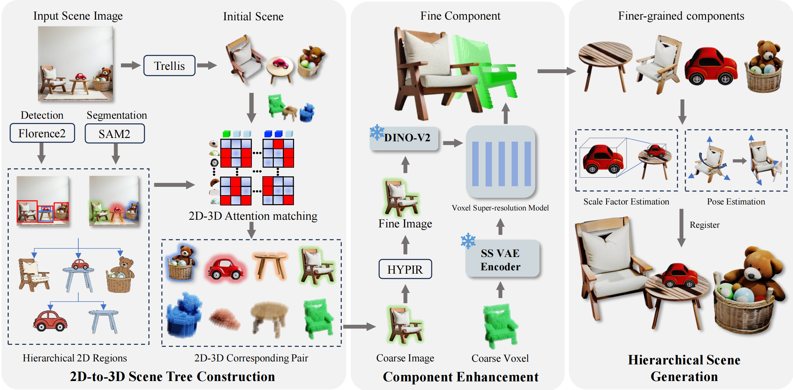

# HIVE-3D: Hierarchical Voxel Enhancement for High-Quality 3D Scene Generation

**ICML 2026**

**[Project Page](https://xbdff.github.io/HIVE-3D/)** · **[Paper](https://arxiv.org/abs/2607.13468)** · **[Hugging Face Model](https://huggingface.co/mocun123/HIVE-3D)**

Bin Zang, Wenting Zheng, Xiaoliang Luo, Zhiyuan Fang, Shi Li, Lvchun Wang, Wei Yu, Yi Zhao, Tian Xie, Yuchi Huo, and Rengan Xie

HIVE-3D generates high-quality 3D scenes from a single image through hierarchical voxel enhancement. It extends [Microsoft TRELLIS](https://github.com/microsoft/TRELLIS) with object segmentation, 2D-to-3D component retrieval, hierarchical scene decomposition, and coarse-to-fine voxel super-resolution. The Gradio application provides SAM2/Grounding DINO prompts, optional HYPIR image enhancement, and side-by-side TRELLIS and HIVE-3D reconstruction results.

<p align="center">
  
</p>

<p align="center"><em>HIVE-3D performs hierarchical image and voxel enhancement to reconstruct detailed 3D scenes from a single image.</em></p>

## Installation

### 1. Prepare a working TRELLIS environment

HIVE-3D uses TRELLIS's PyTorch, CUDA, and compiled extensions. Follow the [official TRELLIS installation guide](https://github.com/microsoft/TRELLIS#installation) and confirm that TRELLIS image-to-3D inference runs successfully before installing the HIVE-3D additions.

Use the PyTorch and CUDA versions recommended by TRELLIS. If your GPU architecture requires a different supported combination, make that TRELLIS environment work first and build or install its CUDA extensions against the same stack. HIVE-3D does not impose a separate CUDA version.

The supplemental HIVE-3D requirements intentionally do not manage:

- PyTorch, torchvision, or torchaudio
- CUDA runtime or toolkit packages
- flash-attn or xformers
- spconv or cumm
- Kaolin, nvdiffrast, diffoctreerast, or diff-gaussian-rasterization

### 2. Clone the TRELLIS environment

From the cloned HIVE-3D repository:

```bash
cd HIVE-3D
conda create --name hive-3d --clone trellis
conda activate hive-3d
pip install -r requirements.txt
```

If your working TRELLIS environment is not named `trellis`, replace the source name in the `conda create --clone` command. Do not install `requirements.txt` into a fresh environment: it contains only the packages added by HIVE-3D.

The release was prepared in the following recorded environment: Python 3.10.19, PyTorch 2.11.0+cu128, and CUDA runtime 12.8. These versions document the environment used for release validation; compatible TRELLIS-supported combinations may also work. A successful end-to-end run on your own GPU remains the authoritative compatibility check.

### 3. Launch the Gradio application

Run from the repository root:

```bash
python gradio_scripts/gradio_app.py
```

Open the URL printed in the terminal. SAM2, Grounding DINO, and HYPIR are initialized when Gradio starts. TRELLIS and HIVE-3D are loaded when `Generate Scene` is clicked, so their loading messages do not appear during the initial Gradio startup.

The application binds to `127.0.0.1` by default. To make it reachable on a trusted LAN, opt in explicitly:

```bash
GRADIO_SERVER_NAME=0.0.0.0 python gradio_scripts/gradio_app.py
```

Binding to `0.0.0.0` exposes the service on every network interface. Use network-level access controls and do not expose this research demo directly to the public internet.

## Usage

### 1. Upload and prompt an image

Upload a single scene image in the **Input Image** panel, then choose one of the segmentation modes:

- `box`: drag one bounding box around each object.
- `point`: left-click foreground points and right-click background points.
- `box+point`: combine bounding boxes with foreground/background points.
- `label`: enter comma-separated object names such as `chair, table`; Grounding DINO detects the objects before SAM2 segmentation.

For label-based detection, adjust **Detection Threshold** when objects are missed or false detections appear. **Polygon Refinement** can produce cleaner object boundaries.

### 2. Define scene components

Uploading a configuration JSON is optional. Without one, the application creates a flat root in which every segmented object is a direct child of the scene. The public demo currently accepts this flat form only; nested `scene_tree` entries are rejected until recursive transform composition has been validated. Use the following format:

```json
{
  "labels": ["0", "1"],
  "scene_tree": {
    "scene": ["0", "1"]
  }
}
```

An example is available at [`assets/example/config.json`](assets/example/config.json). Object labels must correspond to the generated object indices.

### 3. Configure optional HYPIR enhancement

Open **Super-Resolution Settings (HYPIR)** to enhance each extracted object before reconstruction. You can set an enhancement prompt and an upscale factor from 1× to 4×. Entering `auto` requires all three optional captioner variables: `GPT_API_KEY`, `GPT_BASE_URL`, and `GPT_MODEL`. Otherwise, provide a prompt directly or leave it empty. If enhancement fails, the original object image is retained and the UI reports that it was not enhanced.

### 4. Segment and reconstruct

1. Click **Run Analysis** to generate the combined segmentation map, object cutouts, masks, scene image, and configuration file.
2. Inspect the extracted objects and download the generated ZIP archive if needed.
3. Click **Generate Scene** to load TRELLIS and HIVE-3D, run reconstruction, and compare the two output videos.
4. Enable **Debug Outputs** before scene generation only when intermediate voxels, point clouds, and videos are required.

Generated runs, including uploaded images, masks, archives, and videos, remain under `outputs/<run-id>/` until the operator removes them. Preview directories older than seven days with:

```bash
find outputs -mindepth 1 -maxdepth 1 -mtime +7 -print
```

Review that list and remove only the intended run directories with a separate, explicit command. Model loading and reconstruction failures are reported in the terminal running Gradio.

## Validation

Install the release test dependency and run the CPU suite:

```bash
python -m pip install -r requirements-dev.txt
python -m pytest -q
```

The end-to-end GPU smoke test uses the bundled flat-scene example:

```bash
python gradio_scripts/scene_script.py --input_dir assets/example
```

This command writes `result_trellis.mp4` and `result_hive3d.mp4` into the input directory. Move or remove those generated files after verification; they are not release assets.

## Model downloads

The following Hugging Face repositories are used by default:

| Component | Hugging Face source |
| --- | --- |
| TRELLIS | [`microsoft/TRELLIS-image-large`](https://huggingface.co/microsoft/TRELLIS-image-large) |
| HIVE-3D | [`mocun123/HIVE-3D`](https://huggingface.co/mocun123/HIVE-3D) |
| Grounding DINO | [`IDEA-Research/grounding-dino-tiny`](https://huggingface.co/IDEA-Research/grounding-dino-tiny) |
| SAM2 | [`facebook/sam2-hiera-large`](https://huggingface.co/facebook/sam2-hiera-large) |
| HYPIR weights | [`lxq007/HYPIR/HYPIR_sd2.pth`](https://huggingface.co/lxq007/HYPIR/blob/main/HYPIR_sd2.pth) |
| HYPIR SD2 base | [`sd2-community/stable-diffusion-2-1-base`](https://huggingface.co/sd2-community/stable-diffusion-2-1-base) |

Weights are downloaded on first use and cached under the standard Hugging Face cache directory. Initial use therefore requires network access and several gigabytes of free disk space.

The two scene-generation model sources can be overridden without editing code:

```bash
export TRELLIS_MODEL=microsoft/TRELLIS-image-large
export HIVE3D_MODEL=mocun123/HIVE-3D
python gradio_scripts/gradio_app.py
```

Public repositories do not require authentication. Set `HF_TOKEN` before launch when using a private or gated replacement repository.

## Troubleshooting

- Verify the original TRELLIS example before cloning the environment. Resolve TRELLIS installation failures first.
- Ensure every compiled CUDA extension matches the active PyTorch and CUDA versions.
- Check that the selected GPU has enough free memory for segmentation, enhancement, and scene generation models.
- Model files may already exist in the Hugging Face cache, in which case no download progress is shown.
- `Generate Scene` launches scene generation after segmentation assets have been created; model loading and generation logs are printed in the server terminal.

## Citation

If you find HIVE-3D useful, please cite:

```bibtex
@article{zang2026hive3d,
  title   = {HIVE-3D: Hierarchical Voxel Enhancement for High-Quality 3D Scene Generation},
  author  = {Zang, Bin and Zheng, Wenting and Luo, Xiaoliang and Fang, Zhiyuan and Li, Shi and Wang, Lvchun and Yu, Wei and Zhao, Yi and Xie, Tian and Huo, Yuchi and Xie, Rengan},
  journal = {arXiv preprint arXiv:2607.13468},
  year    = {2026}
}
```

## License

HIVE-3D is released for academic research and non-commercial use only. Original HIVE-3D source contributions are licensed under the [PolyForm Noncommercial License 1.0.0](LICENSE).

Bundled third-party components retain their original licenses and are not relicensed by HIVE-3D. In particular, HYPIR and Gaussian Splatting-derived components impose separate non-commercial restrictions. See [Third-Party Notices](THIRD_PARTY_NOTICES.md) for the applicable paths, complete local license texts, and runtime model terms.

Commercial use of the complete workflow may require separate written permission from HIVE-3D and third-party copyright holders. Example assets are governed by the directory-level provenance entries in [Third-Party Notices](THIRD_PARTY_NOTICES.md); the root source-code license does not grant rights to unrelated images.
